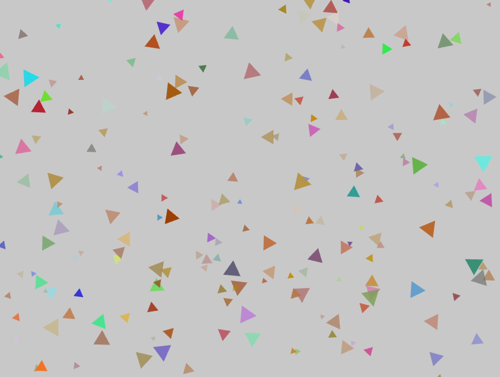
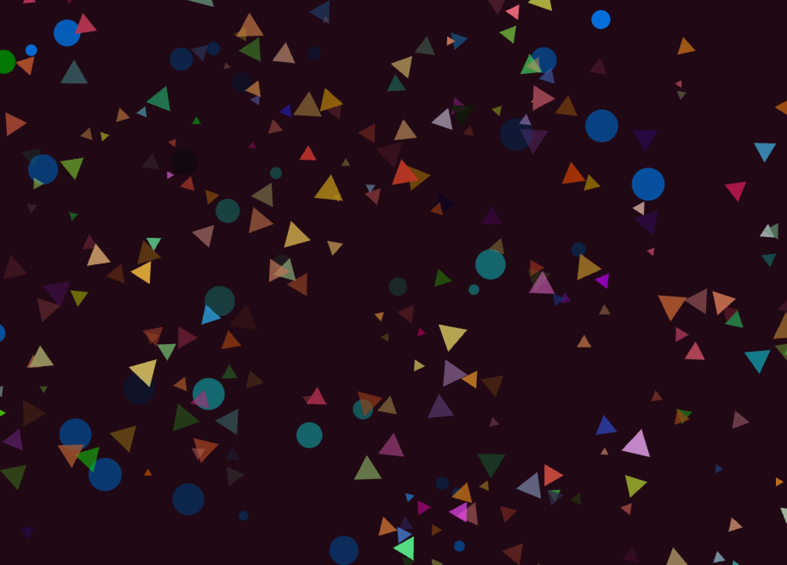
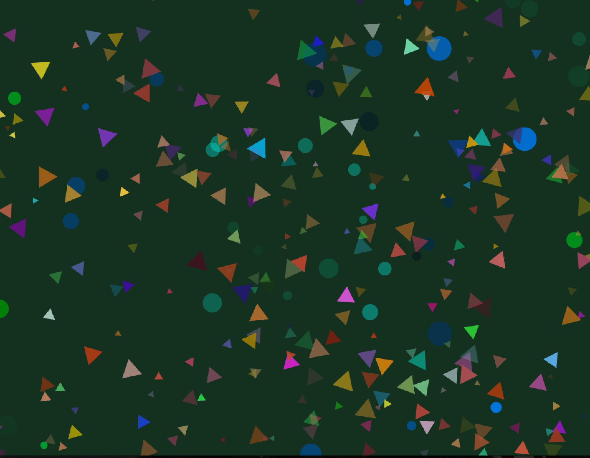

##Bubbles
This project generates arrays of tringles at random locations that slowly fade as they drift away from the origin point. When the left mouse button is clicked then an array of circles is created with the color slowly getting darker as the circles drift farther away. When a circle leaves the screen the background color changes.

The positions for both classes are randomly generated.
    for(int i=0; i<bubbleys.size(); i++) {
        bubbleys[i].update();
        float distance=ofDist(bubbleys[i].start.x,bubbleys[i].start.y,bubbleys[i].pos.x,bubbleys[i].pos.y);
        if(distance>500){
            bubbleys.erase(bubbleys.begin()+i);
            i--;
        }
    }
    for(int i=0; i<balls.size(); i++) {
        balls[i].update();
        float distance=ofDist(balls[i].start.x,balls[i].start.y,balls[i].pos.x,balls[i].pos.y);
        if(distance>800){
            balls.erase(balls.begin()+i);
            i--;
        }
    }

Where the balls hit the sides to switch the background color.
    float distance = ofDist(start.x,start.y,pos.x,pos.y);
    float bright = ofMap(distance,0,500,0,255);
    float green = ofMap(distance,0,200,150,255);
    float blue = ofMap(distance,0,200,50,255);
    col.a=(bright);
    col.g=(green);
    col.b=(blue);

    if(((pos.x>=winx)&&(pos.x<=winx+10))||((pos.x<=0)&&(pos.x>=winx-10))) {
        ofBackground(ofRandom(0,50),ofRandom(0,50),ofRandom(0,50));
    }
    if(((pos.y>=winy)&&(pos.y<=winy+10))||((pos.y<=0)&&(pos.y>=winy-10))) {
        ofBackground(ofRandom(0,50),ofRandom(0,50),ofRandom(0,50));
    }
And finally accounting for the mouse click.
    ofApp::update(){
    if(ofGetMousePressed()){
        
        Ball tempBall;
        tempBall.setup();
        balls.push_back(tempBall);
    }
ofApp::draw(){
	    ofSetCircleResolution(3);
    for(int i=0; i<bubbleys.size(); i++) {
        bubbleys[i].draw();
    }
    

